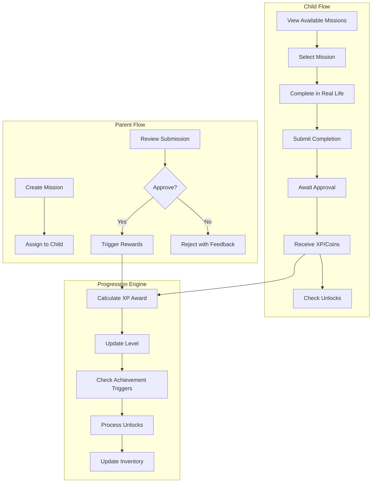
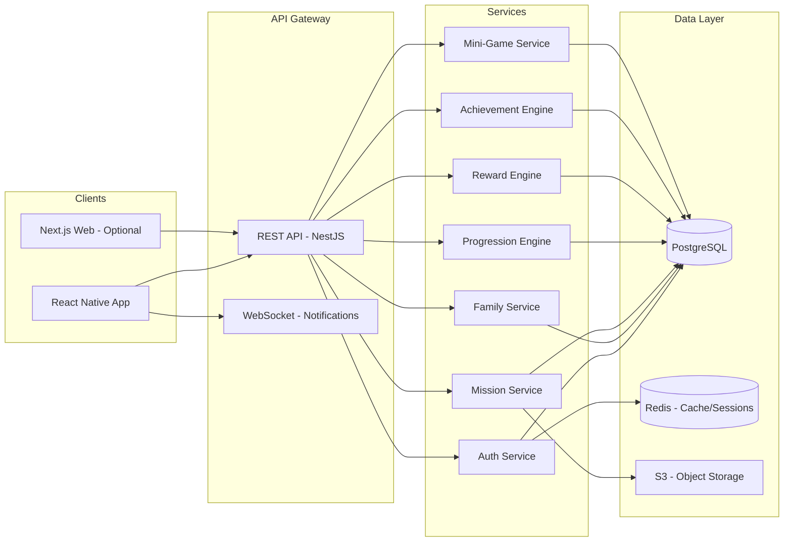
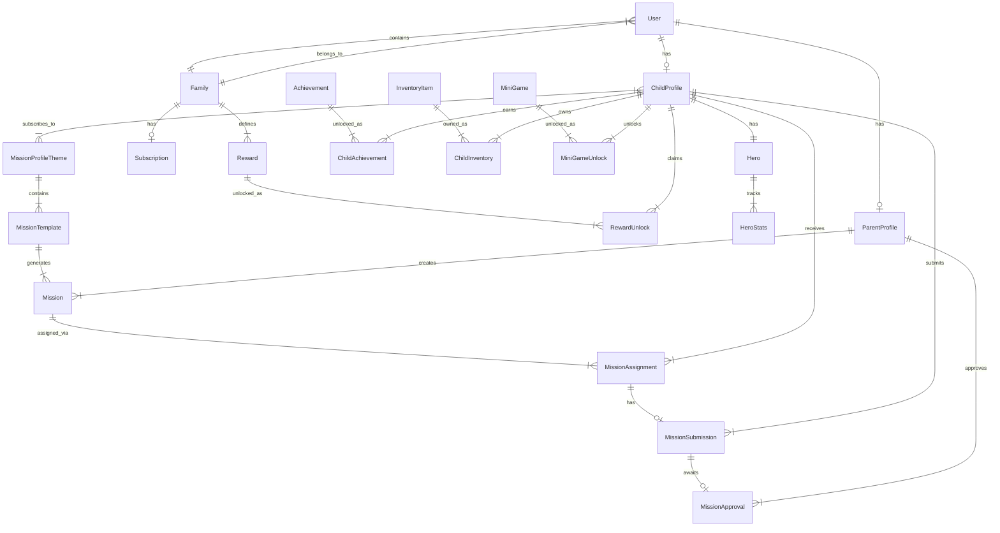
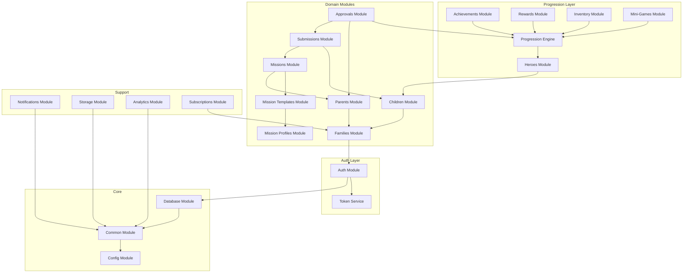
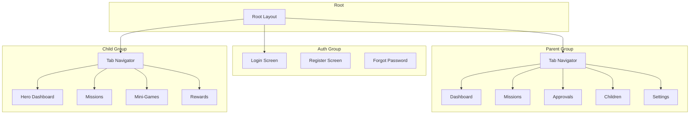

# TaskHero - Architecture & Implementation Plan

> **Document Status**: FINALIZED - Awaiting stakeholder approval
> **Last Updated**: 2026-03-21

## Key Decisions Summary

| Decision | Choice | Notes |
|----------|--------|-------|
| Child Auth Model | Family invite code + PIN | Child downloads app, enters family code + personal PIN |
| Photo Evidence | Optional per mission | Parent decides per mission if photo required |
| Platform | Mobile-only MVP | React Native + Expo, web panel deferred |
| Level Progression | Exponential curve | Later levels require more XP |
| Free Tier Limits | Unlimited for MVP | Add monetization limits later |
| MVP Mini-Game | Tap Collector | Dynamic falling items game |

---

## 1. Product Restatement in Engineering Terms

### Core System Description
TaskHero is a **multi-tenant family-centric gamification platform** with the following technical characteristics:

- **Multi-role authentication system**: Parent (admin) and Child (limited) roles within family tenants
- **Mission management system**: CRUD operations for task/mission entities with assignment, submission, and approval workflows
- **Gamification engine**: XP/coin economy, level progression, achievement triggers, inventory management
- **Content profile system**: Categorized mission templates with tagging and filtering capabilities
- **Reward orchestration**: Digital progression rewards + real-world reward tracking with unlock conditions
- **Mini-game integration layer**: Conditional access to embedded game modules based on progression state

### Key Technical Workflows



### Data Flow Architecture



---

## 2. Recommended Tech Stack

### Frontend / Mobile

| Layer | Technology | Rationale |
|-------|------------|-----------|
| **Mobile Framework** | React Native + Expo SDK 52 | Cross-platform, fast iteration, excellent DX, OTA updates |
| **Navigation** | Expo Router | File-based routing, deep linking support |
| **State Management** | Zustand + React Query | Simple global state + powerful server state caching |
| **UI Components** | React Native Paper + Custom | Material Design base with custom gamification components |
| **Animations** | React Native Reanimated 3 | Smooth 60fps animations for progression feedback |
| **Forms** | React Hook Form + Zod | Type-safe validation matching backend schemas |

### Backend

| Layer | Technology | Rationale |
|-------|------------|-----------|
| **Runtime** | Node.js 20 LTS | Stable, well-supported |
| **Framework** | NestJS 10 | Modular architecture, dependency injection, great for scaling |
| **Language** | TypeScript 5.4+ | End-to-end type safety |
| **API Style** | REST + OpenAPI | Well-documented, easy client generation |
| **Validation** | class-validator + class-transformer | DTO validation integrated with NestJS |
| **Documentation** | Swagger/OpenAPI | Auto-generated API docs |

### Database & Storage

| Layer | Technology | Rationale |
|-------|------------|-----------|
| **Primary DB** | PostgreSQL 16 | Relational integrity, JSONB for flexible configs |
| **ORM** | Prisma 5 | Type-safe queries, migrations, excellent DX |
| **Cache** | Redis 7 | Session storage, rate limiting, pub/sub for notifications |
| **Object Storage** | MinIO (dev) / S3 (prod) | Photo uploads, mission evidence |

### Authentication & Security

| Layer | Technology | Rationale |
|-------|------------|-----------|
| **Auth Strategy** | JWT + Refresh Tokens | Stateless auth with secure rotation |
| **Password Hashing** | bcrypt | Industry standard |
| **Role Management** | CASL | Flexible attribute-based access control |

### DevOps & Infrastructure

| Layer | Technology | Rationale |
|-------|------------|-----------|
| **Containerization** | Docker + docker-compose | Consistent dev/prod environments |
| **CI/CD** | GitHub Actions | Automated testing and deployment |
| **Environment Config** | dotenv + joi validation | Type-safe configuration |
| **Logging** | Pino | Fast structured logging |
| **Monitoring** | OpenTelemetry ready | Future observability |

### Testing

| Layer | Technology | Rationale |
|-------|------------|-----------|
| **Unit Tests** | Jest | Standard, well-integrated |
| **E2E API Tests** | Supertest + Jest | API contract testing |
| **Mobile Tests** | Jest + React Native Testing Library | Component testing |
| **E2E Mobile** | Detox (optional) | Full device testing |

---

## 3. Core Domain Model

### Entity Relationship Diagram



### Core Entities Description

#### Identity & Access
- **User**: Authentication entity with email/password, linked to either Parent or Child profile
- **Family**: Multi-tenant container, all family members share this context
- **ParentProfile**: Extended parent attributes, permissions, preferences
- **ChildProfile**: Extended child attributes, age, avatar selection, active profiles

#### Mission System
- **MissionProfileTheme**: Categories like Nature, Food, History, Creativity
- **MissionTemplate**: Reusable mission blueprints within themes
- **Mission**: Concrete mission instance created by parent
- **MissionAssignment**: Links mission to specific child with due dates
- **MissionSubmission**: Child's completion claim with optional evidence
- **MissionApproval**: Parent's verification decision

#### Progression System
- **Hero**: Child's game avatar with level, XP, coins
- **HeroStats**: Historical tracking of progression events
- **Achievement**: Global achievement definitions with unlock conditions
- **ChildAchievement**: Junction table for earned achievements

#### Rewards & Inventory
- **Reward**: Parent-defined real-world rewards with unlock conditions
- **RewardUnlock**: Tracks when child earns/claims rewards
- **InventoryItem**: Global catalog of digital items (cosmetics, power-ups)
- **ChildInventory**: Junction table for owned items

#### Mini-Games
- **MiniGame**: Game definitions with unlock requirements
- **MiniGameUnlock**: Tracks child's access to games

---

## 4. Database Schema (Prisma)

```prisma
// schema.prisma

generator client {
  provider = "prisma-client-js"
}

datasource db {
  provider = "postgresql"
  url      = env("DATABASE_URL")
}

// ==================== ENUMS ====================

enum UserRole {
  PARENT
  CHILD
}

enum MissionCategory {
  DAILY_CHORE
  HABIT
  EDUCATIONAL
  CREATIVE
  OUTDOOR
  PHYSICAL
}

enum MissionStatus {
  DRAFT
  ACTIVE
  COMPLETED
  ARCHIVED
}

enum AssignmentStatus {
  PENDING
  IN_PROGRESS
  SUBMITTED
  APPROVED
  REJECTED
  EXPIRED
}

enum ApprovalDecision {
  APPROVED
  REJECTED
}

enum RecurrenceType {
  NONE
  DAILY
  WEEKLY
  MONTHLY
}

enum UnlockConditionType {
  LEVEL_REACHED
  XP_THRESHOLD
  COIN_THRESHOLD
  MISSION_COUNT
  STREAK_DAYS
  ACHIEVEMENT_EARNED
  PROFILE_COMPLETED
}

enum SubscriptionTier {
  FREE
  PREMIUM
  FAMILY_PLUS
}

enum SubscriptionStatus {
  ACTIVE
  CANCELLED
  PAST_DUE
  TRIALING
}

// ==================== IDENTITY & ACCESS ====================

model User {
  id            String    @id @default(cuid())
  email         String    @unique
  passwordHash  String
  role          UserRole
  familyId      String
  family        Family    @relation(fields: [familyId], references: [id], onDelete: Cascade)
  
  parentProfile ParentProfile?
  childProfile  ChildProfile?
  
  refreshTokens RefreshToken[]
  
  createdAt     DateTime  @default(now())
  updatedAt     DateTime  @updatedAt
  lastLoginAt   DateTime?
  isActive      Boolean   @default(true)
  
  @@index([familyId])
  @@index([email])
}

model RefreshToken {
  id          String   @id @default(cuid())
  token       String   @unique
  userId      String
  user        User     @relation(fields: [userId], references: [id], onDelete: Cascade)
  expiresAt   DateTime
  createdAt   DateTime @default(now())
  revokedAt   DateTime?
  
  @@index([userId])
  @@index([token])
}

model Family {
  id              String    @id @default(cuid())
  name            String
  inviteCode      String    @unique @default(cuid())
  
  users           User[]
  rewards         Reward[]
  subscription    Subscription?
  
  settings        Json      @default("{}")
  timezone        String    @default("UTC")
  
  createdAt       DateTime  @default(now())
  updatedAt       DateTime  @updatedAt
  
  @@index([inviteCode])
}

model ParentProfile {
  id              String    @id @default(cuid())
  userId          String    @unique
  user            User      @relation(fields: [userId], references: [id], onDelete: Cascade)
  
  displayName     String
  avatarUrl       String?
  
  missions        Mission[]
  approvals       MissionApproval[]
  
  preferences     Json      @default("{}")
  notificationSettings Json @default("{}")
  
  createdAt       DateTime  @default(now())
  updatedAt       DateTime  @updatedAt
}

model ChildProfile {
  id              String    @id @default(cuid())
  userId          String    @unique
  user            User      @relation(fields: [userId], references: [id], onDelete: Cascade)
  
  displayName     String
  avatarUrl       String?
  dateOfBirth     DateTime?
  
  hero            Hero?
  assignments     MissionAssignment[]
  submissions     MissionSubmission[]
  achievements    ChildAchievement[]
  inventory       ChildInventory[]
  miniGameUnlocks MiniGameUnlock[]
  rewardUnlocks   RewardUnlock[]
  
  // Subscribed mission themes
  activeProfiles  ChildProfileTheme[]
  
  preferences     Json      @default("{}")
  
  createdAt       DateTime  @default(now())
  updatedAt       DateTime  @updatedAt
}

// ==================== MISSION PROFILES & THEMES ====================

model MissionProfileTheme {
  id              String    @id @default(cuid())
  slug            String    @unique
  name            String
  description     String
  iconUrl         String?
  color           String?   // Hex color for UI theming
  
  templates       MissionTemplate[]
  childProfiles   ChildProfileTheme[]
  
  isActive        Boolean   @default(true)
  sortOrder       Int       @default(0)
  
  metadata        Json      @default("{}")
  
  createdAt       DateTime  @default(now())
  updatedAt       DateTime  @updatedAt
}

model ChildProfileTheme {
  id              String    @id @default(cuid())
  childProfileId  String
  childProfile    ChildProfile @relation(fields: [childProfileId], references: [id], onDelete: Cascade)
  themeId         String
  theme           MissionProfileTheme @relation(fields: [themeId], references: [id], onDelete: Cascade)
  
  isActive        Boolean   @default(true)
  enabledAt       DateTime  @default(now())
  
  @@unique([childProfileId, themeId])
  @@index([childProfileId])
  @@index([themeId])
}

model MissionTemplate {
  id              String    @id @default(cuid())
  themeId         String
  theme           MissionProfileTheme @relation(fields: [themeId], references: [id], onDelete: Cascade)
  
  title           String
  description     String
  instructions    String?
  category        MissionCategory
  
  suggestedXp     Int       @default(10)
  suggestedCoins  Int       @default(5)
  
  difficulty      Int       @default(1) // 1-5 scale
  estimatedMinutes Int?
  
  ageMinimum      Int?
  ageMaximum      Int?
  
  iconUrl         String?
  tags            String[]  @default([])
  
  isActive        Boolean   @default(true)
  isAiGenerated   Boolean   @default(false)
  
  missions        Mission[]
  
  metadata        Json      @default("{}")
  
  createdAt       DateTime  @default(now())
  updatedAt       DateTime  @updatedAt
  
  @@index([themeId])
  @@index([category])
}

// ==================== MISSIONS ====================

model Mission {
  id              String    @id @default(cuid())
  
  // Creator
  createdById     String
  createdBy       ParentProfile @relation(fields: [createdById], references: [id], onDelete: Cascade)
  
  // Optional template reference
  templateId      String?
  template        MissionTemplate? @relation(fields: [templateId], references: [id], onDelete: SetNull)
  
  title           String
  description     String
  instructions    String?
  category        MissionCategory
  
  xpReward        Int       @default(10)
  coinReward      Int       @default(5)
  
  // Optional badge/unlock on completion
  badgeId         String?
  unlockItemId    String?
  
  // Recurrence
  recurrenceType  RecurrenceType @default(NONE)
  recurrenceRule  Json?     // For complex recurrence patterns
  
  status          MissionStatus @default(ACTIVE)
  
  // Real-world reward link
  realWorldRewardId String?
  realWorldReward Reward?   @relation(fields: [realWorldRewardId], references: [id], onDelete: SetNull)
  
  assignments     MissionAssignment[]
  
  requiresEvidence Boolean  @default(false)
  evidencePrompt  String?
  
  metadata        Json      @default("{}")
  
  createdAt       DateTime  @default(now())
  updatedAt       DateTime  @updatedAt
  archivedAt      DateTime?
  
  @@index([createdById])
  @@index([status])
  @@index([category])
}

model MissionAssignment {
  id              String    @id @default(cuid())
  
  missionId       String
  mission         Mission   @relation(fields: [missionId], references: [id], onDelete: Cascade)
  
  childProfileId  String
  childProfile    ChildProfile @relation(fields: [childProfileId], references: [id], onDelete: Cascade)
  
  status          AssignmentStatus @default(PENDING)
  
  assignedAt      DateTime  @default(now())
  dueAt           DateTime?
  startedAt       DateTime?
  completedAt     DateTime?
  
  // For recurring missions
  recurrenceIndex Int       @default(0)
  
  submission      MissionSubmission?
  
  notes           String?
  
  @@unique([missionId, childProfileId, recurrenceIndex])
  @@index([childProfileId])
  @@index([status])
  @@index([dueAt])
}

model MissionSubmission {
  id              String    @id @default(cuid())
  
  assignmentId    String    @unique
  assignment      MissionAssignment @relation(fields: [assignmentId], references: [id], onDelete: Cascade)
  
  childProfileId  String
  childProfile    ChildProfile @relation(fields: [childProfileId], references: [id], onDelete: Cascade)
  
  submittedAt     DateTime  @default(now())
  
  // Evidence
  notes           String?
  photoUrls       String[]  @default([])
  
  approval        MissionApproval?
  
  @@index([childProfileId])
}

model MissionApproval {
  id              String    @id @default(cuid())
  
  submissionId    String    @unique
  submission      MissionSubmission @relation(fields: [submissionId], references: [id], onDelete: Cascade)
  
  approvedById    String
  approvedBy      ParentProfile @relation(fields: [approvedById], references: [id], onDelete: Cascade)
  
  decision        ApprovalDecision
  feedback        String?
  
  // Actual rewards granted (may differ from mission defaults)
  xpAwarded       Int
  coinsAwarded    Int
  
  decidedAt       DateTime  @default(now())
  
  @@index([approvedById])
}

// ==================== PROGRESSION ====================

model Hero {
  id              String    @id @default(cuid())
  
  childProfileId  String    @unique
  childProfile    ChildProfile @relation(fields: [childProfileId], references: [id], onDelete: Cascade)
  
  name            String    @default("Hero")
  avatarType      String    @default("default")
  
  level           Int       @default(1)
  currentXp       Int       @default(0)
  totalXp         Int       @default(0)
  coins           Int       @default(0)
  totalCoinsEarned Int      @default(0)
  
  // Streak tracking
  currentStreak   Int       @default(0)
  longestStreak   Int       @default(0)
  lastActivityAt  DateTime?
  
  stats           HeroStats[]
  
  // Equipped items
  equippedItems   Json      @default("{}")
  
  createdAt       DateTime  @default(now())
  updatedAt       DateTime  @updatedAt
}

model HeroStats {
  id              String    @id @default(cuid())
  
  heroId          String
  hero            Hero      @relation(fields: [heroId], references: [id], onDelete: Cascade)
  
  // Snapshot date for historical tracking
  date            DateTime  @default(now()) @db.Date
  
  missionsCompleted Int     @default(0)
  xpEarned        Int       @default(0)
  coinsEarned     Int       @default(0)
  
  // Category breakdown
  categoryStats   Json      @default("{}")
  
  @@unique([heroId, date])
  @@index([heroId])
  @@index([date])
}

// ==================== ACHIEVEMENTS ====================

model Achievement {
  id              String    @id @default(cuid())
  
  slug            String    @unique
  name            String
  description     String
  iconUrl         String?
  
  // Unlock condition
  conditionType   UnlockConditionType
  conditionValue  Int       // e.g., level 5, 100 XP, 10 missions
  conditionMeta   Json?     // Additional condition parameters
  
  // Rewards for earning
  xpReward        Int       @default(0)
  coinReward      Int       @default(0)
  unlockItemId    String?
  
  isSecret        Boolean   @default(false)
  isActive        Boolean   @default(true)
  sortOrder       Int       @default(0)
  
  children        ChildAchievement[]
  
  createdAt       DateTime  @default(now())
  updatedAt       DateTime  @updatedAt
}

model ChildAchievement {
  id              String    @id @default(cuid())
  
  childProfileId  String
  childProfile    ChildProfile @relation(fields: [childProfileId], references: [id], onDelete: Cascade)
  
  achievementId   String
  achievement     Achievement @relation(fields: [achievementId], references: [id], onDelete: Cascade)
  
  unlockedAt      DateTime  @default(now())
  
  // Progress tracking for partial achievements
  currentProgress Int       @default(0)
  isComplete      Boolean   @default(false)
  
  @@unique([childProfileId, achievementId])
  @@index([childProfileId])
}

// ==================== MINI-GAMES ====================

model MiniGame {
  id              String    @id @default(cuid())
  
  slug            String    @unique
  name            String
  description     String
  iconUrl         String?
  thumbnailUrl    String?
  
  // Unlock condition
  conditionType   UnlockConditionType
  conditionValue  Int
  conditionMeta   Json?
  
  // Game configuration
  gameType        String    // e.g., "memory", "tap-collect", "quiz"
  gameConfig      Json      @default("{}")
  
  isActive        Boolean   @default(true)
  isPremiumOnly   Boolean   @default(false)
  sortOrder       Int       @default(0)
  
  unlocks         MiniGameUnlock[]
  
  createdAt       DateTime  @default(now())
  updatedAt       DateTime  @updatedAt
}

model MiniGameUnlock {
  id              String    @id @default(cuid())
  
  childProfileId  String
  childProfile    ChildProfile @relation(fields: [childProfileId], references: [id], onDelete: Cascade)
  
  miniGameId      String
  miniGame        MiniGame  @relation(fields: [miniGameId], references: [id], onDelete: Cascade)
  
  unlockedAt      DateTime  @default(now())
  
  // Game stats
  timesPlayed     Int       @default(0)
  highScore       Int       @default(0)
  lastPlayedAt    DateTime?
  
  @@unique([childProfileId, miniGameId])
  @@index([childProfileId])
}

// ==================== INVENTORY ====================

model InventoryItem {
  id              String    @id @default(cuid())
  
  slug            String    @unique
  name            String
  description     String
  iconUrl         String?
  
  itemType        String    // e.g., "avatar", "background", "badge", "powerup"
  
  // Acquisition methods
  coinCost        Int?      // Can be purchased
  unlockCondition UnlockConditionType?
  unlockValue     Int?
  
  isActive        Boolean   @default(true)
  isPremiumOnly   Boolean   @default(false)
  sortOrder       Int       @default(0)
  
  children        ChildInventory[]
  
  metadata        Json      @default("{}")
  
  createdAt       DateTime  @default(now())
  updatedAt       DateTime  @updatedAt
}

model ChildInventory {
  id              String    @id @default(cuid())
  
  childProfileId  String
  childProfile    ChildProfile @relation(fields: [childProfileId], references: [id], onDelete: Cascade)
  
  itemId          String
  item            InventoryItem @relation(fields: [itemId], references: [id], onDelete: Cascade)
  
  acquiredAt      DateTime  @default(now())
  acquiredMethod  String    // "purchase", "achievement", "mission", "gift"
  
  quantity        Int       @default(1)
  
  @@unique([childProfileId, itemId])
  @@index([childProfileId])
}

// ==================== REWARDS ====================

model Reward {
  id              String    @id @default(cuid())
  
  familyId        String
  family          Family    @relation(fields: [familyId], references: [id], onDelete: Cascade)
  
  name            String
  description     String?
  iconUrl         String?
  
  // Unlock condition
  conditionType   UnlockConditionType
  conditionValue  Int
  conditionMeta   Json?
  
  // Real-world reward details
  isRealWorld     Boolean   @default(true)
  rewardDetails   String?   // e.g., "One scoop of ice cream"
  
  isActive        Boolean   @default(true)
  isRepeatable    Boolean   @default(false)
  
  missions        Mission[]
  unlocks         RewardUnlock[]
  
  createdAt       DateTime  @default(now())
  updatedAt       DateTime  @updatedAt
  
  @@index([familyId])
}

model RewardUnlock {
  id              String    @id @default(cuid())
  
  childProfileId  String
  childProfile    ChildProfile @relation(fields: [childProfileId], references: [id], onDelete: Cascade)
  
  rewardId        String
  reward          Reward    @relation(fields: [rewardId], references: [id], onDelete: Cascade)
  
  unlockedAt      DateTime  @default(now())
  claimedAt       DateTime?
  
  // For repeatable rewards
  timesEarned     Int       @default(1)
  
  @@index([childProfileId])
  @@index([rewardId])
}

// ==================== SUBSCRIPTION ====================

model SubscriptionPlan {
  id              String    @id @default(cuid())
  
  slug            String    @unique
  name            String
  description     String
  
  tier            SubscriptionTier
  
  monthlyPrice    Decimal   @db.Decimal(10, 2)
  yearlyPrice     Decimal?  @db.Decimal(10, 2)
  
  // Feature limits
  maxChildProfiles Int      @default(1)
  maxActiveMissions Int     @default(5)
  maxRewards      Int       @default(3)
  
  features        Json      @default("[]")
  
  isActive        Boolean   @default(true)
  
  subscriptions   Subscription[]
  
  createdAt       DateTime  @default(now())
  updatedAt       DateTime  @updatedAt
}

model Subscription {
  id              String    @id @default(cuid())
  
  familyId        String    @unique
  family          Family    @relation(fields: [familyId], references: [id], onDelete: Cascade)
  
  planId          String
  plan            SubscriptionPlan @relation(fields: [planId], references: [id])
  
  status          SubscriptionStatus @default(ACTIVE)
  
  currentPeriodStart DateTime
  currentPeriodEnd   DateTime
  
  // External billing reference
  externalId      String?   // Stripe subscription ID
  
  cancelledAt     DateTime?
  
  createdAt       DateTime  @default(now())
  updatedAt       DateTime  @updatedAt
  
  @@index([status])
}

// ==================== NOTIFICATIONS & AUDIT ====================

model Notification {
  id              String    @id @default(cuid())
  
  userId          String
  
  type            String    // "mission_assigned", "mission_approved", "reward_unlocked", etc.
  title           String
  body            String
  
  data            Json      @default("{}")
  
  isRead          Boolean   @default(false)
  readAt          DateTime?
  
  createdAt       DateTime  @default(now())
  
  @@index([userId])
  @@index([isRead])
  @@index([createdAt])
}

model AuditLog {
  id              String    @id @default(cuid())
  
  userId          String?
  familyId        String?
  
  action          String
  entityType      String
  entityId        String?
  
  oldValues       Json?
  newValues       Json?
  
  ipAddress       String?
  userAgent       String?
  
  createdAt       DateTime  @default(now())
  
  @@index([userId])
  @@index([familyId])
  @@index([entityType, entityId])
  @@index([createdAt])
}
```

---

## 5. Backend Module Architecture

### Module Dependency Graph



### Module Responsibilities

```
backend/
├── src/
│   ├── main.ts                    # Application entry point
│   ├── app.module.ts              # Root module
│   │
│   ├── common/                    # Shared utilities
│   │   ├── decorators/            # Custom decorators (@CurrentUser, @Roles)
│   │   ├── filters/               # Exception filters
│   │   ├── guards/                # Auth guards, role guards
│   │   ├── interceptors/          # Logging, transform interceptors
│   │   ├── pipes/                 # Validation pipes
│   │   ├── dto/                   # Shared DTOs
│   │   └── utils/                 # Helper functions
│   │
│   ├── config/                    # Configuration module
│   │   ├── config.module.ts
│   │   ├── config.service.ts
│   │   ├── database.config.ts
│   │   ├── auth.config.ts
│   │   └── app.config.ts
│   │
│   ├── database/                  # Prisma integration
│   │   ├── database.module.ts
│   │   ├── prisma.service.ts
│   │   └── prisma.health.ts
│   │
│   ├── auth/                      # Authentication
│   │   ├── auth.module.ts
│   │   ├── auth.controller.ts
│   │   ├── auth.service.ts
│   │   ├── strategies/
│   │   │   ├── jwt.strategy.ts
│   │   │   └── refresh.strategy.ts
│   │   ├── guards/
│   │   │   ├── jwt-auth.guard.ts
│   │   │   └── roles.guard.ts
│   │   └── dto/
│   │       ├── login.dto.ts
│   │       ├── register.dto.ts
│   │       └── tokens.dto.ts
│   │
│   ├── families/                  # Family management
│   │   ├── families.module.ts
│   │   ├── families.controller.ts
│   │   ├── families.service.ts
│   │   └── dto/
│   │
│   ├── parents/                   # Parent profiles
│   │   ├── parents.module.ts
│   │   ├── parents.controller.ts
│   │   ├── parents.service.ts
│   │   └── dto/
│   │
│   ├── children/                  # Child profiles
│   │   ├── children.module.ts
│   │   ├── children.controller.ts
│   │   ├── children.service.ts
│   │   └── dto/
│   │
│   ├── mission-profiles/          # Themed mission categories
│   │   ├── mission-profiles.module.ts
│   │   ├── mission-profiles.controller.ts
│   │   ├── mission-profiles.service.ts
│   │   └── dto/
│   │
│   ├── mission-templates/         # Reusable mission templates
│   │   ├── mission-templates.module.ts
│   │   ├── mission-templates.controller.ts
│   │   ├── mission-templates.service.ts
│   │   └── dto/
│   │
│   ├── missions/                  # Mission CRUD
│   │   ├── missions.module.ts
│   │   ├── missions.controller.ts
│   │   ├── missions.service.ts
│   │   └── dto/
│   │
│   ├── assignments/               # Mission assignments
│   │   ├── assignments.module.ts
│   │   ├── assignments.controller.ts
│   │   ├── assignments.service.ts
│   │   └── dto/
│   │
│   ├── submissions/               # Completion submissions
│   │   ├── submissions.module.ts
│   │   ├── submissions.controller.ts
│   │   ├── submissions.service.ts
│   │   └── dto/
│   │
│   ├── approvals/                 # Parent approval workflow
│   │   ├── approvals.module.ts
│   │   ├── approvals.controller.ts
│   │   ├── approvals.service.ts
│   │   └── dto/
│   │
│   ├── heroes/                    # Hero/avatar management
│   │   ├── heroes.module.ts
│   │   ├── heroes.controller.ts
│   │   ├── heroes.service.ts
│   │   └── dto/
│   │
│   ├── progression/               # XP/Level progression engine
│   │   ├── progression.module.ts
│   │   ├── progression.service.ts
│   │   ├── level-calculator.ts
│   │   └── progression.events.ts
│   │
│   ├── achievements/              # Achievement system
│   │   ├── achievements.module.ts
│   │   ├── achievements.controller.ts
│   │   ├── achievements.service.ts
│   │   ├── achievement-checker.ts
│   │   └── dto/
│   │
│   ├── rewards/                   # Real-world rewards
│   │   ├── rewards.module.ts
│   │   ├── rewards.controller.ts
│   │   ├── rewards.service.ts
│   │   └── dto/
│   │
│   ├── inventory/                 # Digital item inventory
│   │   ├── inventory.module.ts
│   │   ├── inventory.controller.ts
│   │   ├── inventory.service.ts
│   │   └── dto/
│   │
│   ├── mini-games/                # Mini-game management
│   │   ├── mini-games.module.ts
│   │   ├── mini-games.controller.ts
│   │   ├── mini-games.service.ts
│   │   └── dto/
│   │
│   ├── notifications/             # Notification system
│   │   ├── notifications.module.ts
│   │   ├── notifications.controller.ts
│   │   ├── notifications.service.ts
│   │   ├── notification.gateway.ts  # WebSocket
│   │   └── dto/
│   │
│   ├── storage/                   # File storage abstraction
│   │   ├── storage.module.ts
│   │   ├── storage.service.ts
│   │   └── adapters/
│   │       ├── local.adapter.ts
│   │       └── s3.adapter.ts
│   │
│   ├── subscriptions/             # Billing & feature gating
│   │   ├── subscriptions.module.ts
│   │   ├── subscriptions.controller.ts
│   │   ├── subscriptions.service.ts
│   │   ├── feature-gate.guard.ts
│   │   └── dto/
│   │
│   ├── analytics/                 # Usage analytics
│   │   ├── analytics.module.ts
│   │   ├── analytics.controller.ts
│   │   └── analytics.service.ts
│   │
│   └── ai/                        # AI integration stubs
│       ├── ai.module.ts
│       ├── ai.service.ts
│       └── interfaces/
│           ├── mission-generator.interface.ts
│           └── recommendation.interface.ts
│
├── prisma/
│   ├── schema.prisma
│   ├── migrations/
│   └── seed/
│       ├── index.ts
│       ├── themes.seed.ts
│       ├── templates.seed.ts
│       ├── achievements.seed.ts
│       ├── mini-games.seed.ts
│       ├── items.seed.ts
│       └── demo-family.seed.ts
│
├── test/
│   ├── unit/
│   ├── integration/
│   └── e2e/
│
├── docker/
│   ├── Dockerfile
│   ├── Dockerfile.dev
│   └── docker-compose.yml
│
├── .env.example
├── nest-cli.json
├── tsconfig.json
└── package.json
```

---

## 6. Frontend / Mobile App Structure

### React Native + Expo Structure

```
mobile/
├── app/                           # Expo Router (file-based routing)
│   ├── _layout.tsx                # Root layout
│   ├── index.tsx                  # Entry redirect
│   │
│   ├── (auth)/                    # Auth flow (unauthenticated)
│   │   ├── _layout.tsx
│   │   ├── login.tsx
│   │   ├── register.tsx
│   │   └── forgot-password.tsx
│   │
│   ├── (parent)/                  # Parent experience
│   │   ├── _layout.tsx            # Parent tab navigator
│   │   ├── index.tsx              # Dashboard
│   │   ├── missions/
│   │   │   ├── index.tsx          # Mission list
│   │   │   ├── create.tsx         # Create mission
│   │   │   └── [id].tsx           # Mission detail
│   │   ├── approvals/
│   │   │   ├── index.tsx          # Pending approvals
│   │   │   └── [id].tsx           # Approval detail
│   │   ├── children/
│   │   │   ├── index.tsx          # Children list
│   │   │   ├── add.tsx            # Add child
│   │   │   └── [id]/
│   │   │       ├── index.tsx      # Child progress
│   │   │       └── rewards.tsx    # Child rewards
│   │   ├── rewards/
│   │   │   ├── index.tsx          # Manage rewards
│   │   │   └── create.tsx
│   │   └── settings/
│   │       ├── index.tsx
│   │       ├── family.tsx
│   │       └── subscription.tsx
│   │
│   └── (child)/                   # Child experience
│       ├── _layout.tsx            # Child tab navigator
│       ├── index.tsx              # Hero dashboard
│       ├── missions/
│       │   ├── index.tsx          # Available missions
│       │   └── [id].tsx           # Mission detail & submit
│       ├── hero/
│       │   ├── index.tsx          # Hero profile
│       │   ├── inventory.tsx      # Items & cosmetics
│       │   └── achievements.tsx
│       ├── games/
│       │   ├── index.tsx          # Mini-games list
│       │   └── [slug].tsx         # Play mini-game
│       └── rewards/
│           └── index.tsx          # Unlocked rewards
│
├── src/
│   ├── components/                # Reusable UI components
│   │   ├── common/
│   │   │   ├── Button.tsx
│   │   │   ├── Card.tsx
│   │   │   ├── Input.tsx
│   │   │   ├── Avatar.tsx
│   │   │   ├── Badge.tsx
│   │   │   ├── Modal.tsx
│   │   │   └── Loading.tsx
│   │   │
│   │   ├── progression/
│   │   │   ├── XPBar.tsx
│   │   │   ├── LevelBadge.tsx
│   │   │   ├── CoinDisplay.tsx
│   │   │   ├── StreakIndicator.tsx
│   │   │   └── LevelUpAnimation.tsx
│   │   │
│   │   ├── missions/
│   │   │   ├── MissionCard.tsx
│   │   │   ├── MissionList.tsx
│   │   │   ├── MissionForm.tsx
│   │   │   ├── CategoryPicker.tsx
│   │   │   └── ApprovalCard.tsx
│   │   │
│   │   ├── hero/
│   │   │   ├── HeroAvatar.tsx
│   │   │   ├── HeroStats.tsx
│   │   │   └── EquipmentSlots.tsx
│   │   │
│   │   ├── rewards/
│   │   │   ├── RewardCard.tsx
│   │   │   └── RewardUnlockAnimation.tsx
│   │   │
│   │   └── games/
│   │       ├── GameCard.tsx
│   │       ├── GameLockOverlay.tsx
│   │       └── games/
│   │           └── MemoryGame/
│   │               ├── index.tsx
│   │               ├── MemoryCard.tsx
│   │               └── useMemoryGame.ts
│   │
│   ├── hooks/                     # Custom hooks
│   │   ├── useAuth.ts
│   │   ├── useFamily.ts
│   │   ├── useMissions.ts
│   │   ├── useHero.ts
│   │   ├── useProgression.ts
│   │   └── useNotifications.ts
│   │
│   ├── stores/                    # Zustand stores
│   │   ├── authStore.ts
│   │   ├── familyStore.ts
│   │   ├── userStore.ts
│   │   └── notificationStore.ts
│   │
│   ├── api/                       # API client
│   │   ├── client.ts              # Axios instance
│   │   ├── auth.api.ts
│   │   ├── families.api.ts
│   │   ├── missions.api.ts
│   │   ├── submissions.api.ts
│   │   ├── heroes.api.ts
│   │   ├── achievements.api.ts
│   │   ├── rewards.api.ts
│   │   └── mini-games.api.ts
│   │
│   ├── types/                     # TypeScript types
│   │   ├── api.types.ts
│   │   ├── models.types.ts
│   │   └── navigation.types.ts
│   │
│   ├── utils/                     # Utilities
│   │   ├── storage.ts             # AsyncStorage wrapper
│   │   ├── formatters.ts
│   │   ├── validators.ts
│   │   └── constants.ts
│   │
│   ├── theme/                     # Theming
│   │   ├── colors.ts
│   │   ├── typography.ts
│   │   ├── spacing.ts
│   │   └── index.ts
│   │
│   └── i18n/                      # Internationalization
│       ├── index.ts
│       ├── en.json
│       └── he.json
│
├── assets/
│   ├── images/
│   ├── animations/                # Lottie files
│   └── fonts/
│
├── app.json                       # Expo config
├── eas.json                       # EAS Build config
├── babel.config.js
├── tsconfig.json
└── package.json
```

### Navigation Architecture



---

## 7. Key Product Risks & Ambiguities

### Technical Risks

| Risk | Impact | Mitigation |
|------|--------|------------|
| Child authentication complexity | High | Simplified PIN-based child login under parent session |
| Real-time sync between devices | Medium | Optimistic updates + polling initially, WebSocket later |
| Offline mission completion | Medium | Local queue with sync on reconnect |
| Complex progression calculations | Medium | Centralized progression engine with unit tests |
| Mini-game performance on low-end devices | Low | Simple 2D games, lazy loading |

### Product Ambiguities Requiring Clarification

1. **Child Authentication Model**
2. **Mission Evidence Requirements**
3. **Reward Economy Balance**
4. **Multi-Device Family Scenarios**
5. **Age-Appropriate Content Filtering**
6. **Parental Controls Detail Level**

---

## 8. Questions Before Implementation

See separate section for clarifying questions to be asked.

---

## 9. Implementation Milestones

### Stage 1: Foundation
- Project scaffolding
- Docker + PostgreSQL setup
- NestJS backend structure
- Prisma schema + migrations
- Basic auth flow
- Expo app initialization

### Stage 2: Core Identity
- User registration/login
- Family creation
- Parent profile
- Child profile creation
- JWT + refresh tokens
- Role-based guards

### Stage 3: Mission System
- Mission CRUD
- Mission templates
- Mission profiles/themes
- Mission assignment
- Child mission view
- Mission submission

### Stage 4: Approval & Progression
- Parent approval flow
- Progression engine
- XP/coin awards
- Level calculation
- Hero dashboard
- Streak tracking

### Stage 5: Gamification
- Achievement system
- Achievement triggers
- Inventory system
- Mini-game unlock logic
- Sample mini-game
- Reward system

### Stage 6: Polish & Demo
- UI/UX refinement
- Seed data
- Demo accounts
- Testing
- Documentation
- Deployment prep

---

## 10. Next Steps

1. Review this architecture document
2. Answer clarifying questions
3. Approve or modify the plan
4. Begin Stage 1 implementation
