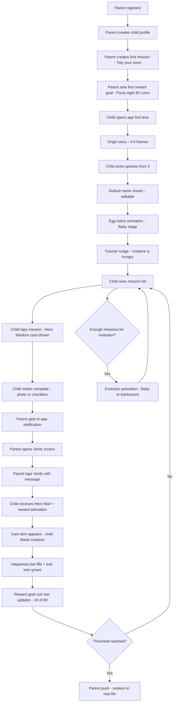
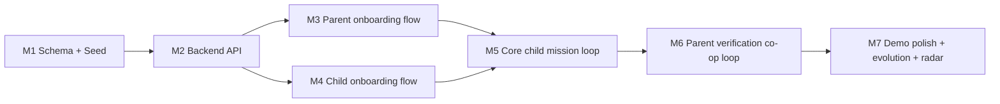

# TaskHero — Demo Flow & Scope Specification

> **Document Status**: PROPOSED — Awaiting stakeholder approval before implementation
> **Last Updated**: 2026-05-23
> **Owner doc**: This document supersedes/extends [`plans/architecture.md`](plans/architecture.md) for everything related to the **demo experience** (creature system, Hero's Wisdom layer, trait-based progression, parent verification co-op loop, and reward goals). The original architecture.md remains the source of truth for infrastructure, auth, deployment, and non-demo subsystems.

---

## 0. Purpose of This Document

The original [`plans/architecture.md`](plans/architecture.md) defined the *platform* (auth, families, missions, rewards, mini-games, achievements, inventory). The demo we now need to ship is a **narrow vertical slice** with a richer narrative layer that the platform schema did not fully anticipate:

- A **virtual creature** with species, naming, evolution stages, happiness, and three named traits (Strength / Wisdom / Heart) — the platform schema only has a generic `Hero` with level/XP.
- A **Hero's Wisdom** educational card attached to each mission (1–2 sentence "did you know?" insight).
- **Mission categories renamed** to Strength / Wisdom / Heart (the platform enum has six different categories).
- **Co-op parent verification** with a personal message ("Hero Mail") delivered alongside the reward animation.
- **Reward goals** as parent-defined coin thresholds with live progress bars (the platform already models these as `Reward` rows with `COIN_THRESHOLD` unlock conditions — we just need to surface them as a first-class concept in the UI).

This doc captures: the demo user flow, the feature inventory, the data-model deltas vs. the current schema, the API surface needed, the screen list, and the milestone breakdown.

---

## 1. Demo User Flow (End-to-End)



---

## 2. Feature Inventory (Demo Scope)

| # | Feature | Viewer | Status vs. Platform |
|---|---------|--------|---------------------|
| F1 | Creature onboarding (species + name + hatch) | Child | **NEW** — needs schema additions |
| F2 | Mission List with category color-coding and XP/coin preview | Child | Existing data model, new UI |
| F3 | Hero's Wisdom card (parchment, 1–2 sentences) | Child | **NEW** field on `MissionTemplate` and `Mission` |
| F4 | Creature Hub (creature sprite + happiness + 3 trait icons + care items) | Child | **NEW** — needs `Creature` model |
| F5 | In-app creature interaction (feed/play/decorate animations) | Child | **NEW** — care item type mapping |
| F6 | Parent Dashboard (pending verifications + trait radar + active missions) | Parent | Existing data, new trait aggregation |
| F7 | Parent Verification with personal message ("Hero Mail") | Parent → Child | Extend `MissionApproval` with message field; surface as Hero Mail |
| F8 | Reward Goal System V1 (coin threshold + progress bar + parent redeem) | Both | Existing `Reward` model; surface as first-class UI |

**Explicitly OUT of demo scope** (deferred):

- World Zones (Forest / Sky / Village) and zone exploration sessions
- Mini-games beyond the home creature interaction
- Brand reward catalog (V2)
- Full achievement system unlocks beyond trait milestones
- Mastery auras and Level 5 special animations
- Subscription / monetization screens

---

## 3. Data Model Deltas vs. Current Schema

The current [`backend/prisma/schema.prisma`](backend/prisma/schema.prisma) was designed for the generic platform. To support the demo, we need the following **additive** changes (no destructive migrations to existing tables).

### 3.1 New Enum: `TraitCategory`

Maps to the three creature-development traits. The existing `MissionCategory` enum (DAILY_CHORE / HABIT / EDUCATIONAL / CREATIVE / OUTDOOR / PHYSICAL) is kept but **each Mission/MissionTemplate gains a `traitCategory` field** that drives creature trait growth.

```prisma
enum TraitCategory {
  STRENGTH   // household/physical → food items
  WISDOM     // educational/creative → toys/activity items
  HEART      // helping family/nature/kindness → accessories
}
```

Mapping from existing `MissionCategory` → `TraitCategory` (used during seeding):

| MissionCategory | TraitCategory |
|---|---|
| DAILY_CHORE | STRENGTH |
| PHYSICAL | STRENGTH |
| OUTDOOR | STRENGTH |
| EDUCATIONAL | WISDOM |
| CREATIVE | WISDOM |
| HABIT | HEART (default; configurable per template) |

### 3.2 New Enums: `CreatureSpecies`, `EvolutionStage`

```prisma
enum CreatureSpecies {
  FOREST_PUP   // default name: Mossy
  SKY_SPRITE   // default name: Lumi
  STONE_CUB    // default name: Rocky
}

enum EvolutionStage {
  EGG          // before first mission verified
  BABY         // 1–19 missions verified
  ADOLESCENT   // 20–59 missions verified
  ADULT        // 60+ missions verified
}
```

**Decision (2026-05-23)**: Use production spec thresholds 20 / 60 / 120. Demo testers will not reach Baby/Adolescent/Adult during a normal sit-down; the evolution flow will be demonstrated by a developer-only "fast-forward" route (`POST /creatures/me/dev-advance`) that bumps the mission counter for screenshot/recording purposes. Thresholds live in [`backend/src/common/utils/progression.ts`](backend/src/common/utils/progression.ts) as named constants `BABY_THRESHOLD = 20`, `ADOLESCENT_THRESHOLD = 60`, `ADULT_THRESHOLD = 120`.

### 3.3 New Model: `Creature`

Replaces/augments the generic `Hero` for the demo. We keep `Hero` for XP/coins/streak (existing progression engine) and add `Creature` 1:1 with `ChildProfile` for the narrative layer.

```prisma
model Creature {
  id              String          @id @default(cuid())

  childProfileId  String          @unique
  childProfile    ChildProfile    @relation(fields: [childProfileId], references: [id], onDelete: Cascade)

  species         CreatureSpecies
  name            String          // default = species default, editable
  stage           EvolutionStage  @default(EGG)

  // Happiness 0–100, depletes ~3 points/hour without interaction
  happiness       Int             @default(50)
  lastHappinessTickAt DateTime    @default(now())

  // Three trait counters (count of verified missions in each trait category)
  strengthPoints  Int             @default(0)
  wisdomPoints    Int             @default(0)
  heartPoints     Int             @default(0)

  // Evolution form is derived: dominant trait at the moment of evolution
  // is recorded so the visual form stays stable even if dominance changes.
  babyEvolvedAt        DateTime?
  adolescentEvolvedAt  DateTime?
  adolescentDominantTrait TraitCategory?
  adultEvolvedAt       DateTime?
  adultDominantTrait      TraitCategory?

  // Inventory of unconsumed care items earned from missions
  pendingCareItems     CareItem[]

  createdAt       DateTime        @default(now())
  updatedAt       DateTime        @updatedAt
}

model CareItem {
  id              String          @id @default(cuid())
  creatureId      String
  creature        Creature        @relation(fields: [creatureId], references: [id], onDelete: Cascade)

  // Which trait spawned it (and therefore what kind of item it is)
  traitCategory   TraitCategory   // STRENGTH→food, WISDOM→toy, HEART→accessory
  itemSlug        String          // e.g., "berry", "puzzle_cube", "flower_crown"

  // Effect on creature when consumed
  happinessDelta  Int             @default(10)
  traitPointDelta Int             @default(1)

  earnedFromAssignmentId String?  // back-reference for analytics

  earnedAt        DateTime        @default(now())
  consumedAt      DateTime?

  @@index([creatureId])
  @@index([consumedAt])
}
```

### 3.4 Additions to Existing Models

**`MissionTemplate` and `Mission`** — add Hero's Wisdom + trait category:

```prisma
// Add to MissionTemplate AND Mission
heroWisdom       String?         // 1–2 sentence parchment-card text
traitCategory    TraitCategory?  // demo-driven; null falls back to MissionCategory mapping
```

**`MissionApproval`** — add the parent's personal message (Hero Mail):

```prisma
// Add to MissionApproval
parentMessage    String?         // max 280 chars; shown as Hero Mail to child
```

**`ChildProfile`** — add reverse relation:

```prisma
creature         Creature?
```

### 3.5 Reward Goals — Use Existing `Reward` Model

No schema change needed. The demo Reward Goal is exactly:

```
Reward {
  isRealWorld:    true
  conditionType:  COIN_THRESHOLD
  conditionValue: 80              // "Pizza night"
  rewardDetails:  "Parent redeems in real life"
}
```

We add a derived **`childRewardProgress`** API endpoint that returns `{ reward, currentCoins, percent }` for the active reward goals so the mobile UI can render the progress bar.

### 3.6 Migration Strategy

The current dev DB has one migration (`20260425151033_init`). All deltas above are **additive** (new tables, nullable columns, new enums) — a single new migration named `add_creature_and_hero_wisdom` will cover everything. No data backfill required because the demo will be seeded fresh.

---

## 4. Backend API Surface (Demo)

| Module | Endpoint | Method | Who | Purpose |
|---|---|---|---|---|
| `auth` | `/auth/register-parent` | POST | public | Existing |
| `auth` | `/auth/login` | POST | public | Existing |
| `auth` | `/auth/child-login` | POST | public | Existing (family code + PIN) |
| `children` | `/children` | POST | parent | Create child profile (auto-creates Hero + EGG Creature) |
| `children` | `/children` | GET | parent | List my children |
| `creatures` | `/creatures/me` | GET | child | Get my creature state (with tick of happiness applied) |
| `creatures` | `/creatures/me/onboard` | POST | child | Pick species + name; transitions EGG → BABY |
| `creatures` | `/creatures/me/feed` | POST | child | Consume a `CareItem`; apply happiness + trait deltas; check evolution |
| `mission-templates` | `/mission-templates` | GET | parent | List seeded library (8 demo missions) |
| `missions` | `/missions` | POST | parent | Create mission (optionally from template) |
| `missions` | `/missions` | GET | parent | List my created missions |
| `assignments` | `/assignments` | POST | parent | Assign mission to a child |
| `assignments` | `/assignments/mine` | GET | child | List my assigned missions (with Hero's Wisdom) |
| `assignments` | `/assignments/:id` | GET | child | Mission detail (full Hero's Wisdom card) |
| `submissions` | `/submissions` | POST | child | Submit completion (note + optional photo) |
| `approvals` | `/approvals/pending` | GET | parent | List submissions awaiting verification |
| `approvals` | `/approvals/:submissionId` | POST | parent | Verify (`{ decision, parentMessage }`); awards XP + coin + spawns CareItem |
| `notifications` | `/notifications/mine` | GET | both | Poll for Hero Mail / verification notifications |
| `rewards` | `/rewards` | POST | parent | Create reward goal |
| `rewards` | `/rewards/family` | GET | both | List family reward goals |
| `rewards/progress` | `/rewards/progress/mine` | GET | child | Active goals + current coin progress |
| `rewards` | `/rewards/:id/redeem` | POST | parent | Mark reward redeemed in real life |
| `progression` | `/progression/trait-summary/:childId` | GET | parent | Radar data: STRENGTH / WISDOM / HEART totals + 30-day history |

### 4.1 Verification Side-Effects (single transaction)

When the parent verifies a submission, the backend atomically:

1. Creates a `MissionApproval` row with `xpAwarded`, `coinsAwarded`, `parentMessage`.
2. Updates `Hero.currentXp`, `Hero.totalXp`, `Hero.coins`, `Hero.totalCoinsEarned`, `Hero.lastActivityAt`.
3. Increments the matching `Creature.{strengthPoints|wisdomPoints|heartPoints}` based on `Mission.traitCategory`.
4. Spawns one `CareItem` whose type is derived from the mission's `traitCategory` (food / toy / accessory).
5. Checks evolution thresholds. If crossed: updates `Creature.stage` and records `*EvolvedAt` + `*DominantTrait`.
6. Re-evaluates active reward goals against new `Hero.coins`. If any threshold met, marks them `unlockedAt` via `RewardUnlock`.
7. Creates a `Notification` of type `"hero_mail"` for the child with the parent's message embedded.

---

## 5. Mobile Screens (Demo Scope)

### 5.1 Parent

| Screen | Route | Notes |
|---|---|---|
| Register | `(auth)/register` | Existing — wire to API |
| Login | `(auth)/login` | Existing — wire to API |
| Dashboard Home | `(parent)/index` | Pending verifications widget + active missions + trait radar |
| Children | `(parent)/children` | Add/edit child profiles; show child's PIN/family code |
| Create Mission | `(parent)/missions` → new `missions/create` modal | Suggested library OR custom; pick trait category + XP + coin + Hero's Wisdom |
| Verify | `(parent)/approvals` → `approvals/[id]` | Photo/note + message field + Verify button |
| Set Reward | `(parent)/rewards` → new `rewards/create` modal | Name + coin threshold |
| Trait Report | within Dashboard | Radar chart (3 axes) + 30-day history |
| Settings | `(parent)/settings` | Existing scaffold |

### 5.2 Child

| Screen | Route | Notes |
|---|---|---|
| Family Code + PIN login | `(auth)/child-login` | Existing — wire to API |
| Origin Story | `(child)/onboarding/story` | **NEW** 4–5 swipeable frames |
| Species Selection | `(child)/onboarding/species` | **NEW** 3 species cards |
| Name Your Creature | `(child)/onboarding/name` | **NEW** default name editable |
| Hatch Animation | `(child)/onboarding/hatch` | **NEW** egg → baby transition |
| Creature Hub (Home) | `(child)/index` | Replace existing scaffold: creature sprite + happiness bar + 3 trait icons + pending care items + reward goal bar |
| Mission List | `(child)/missions` | Category color-coded cards |
| Mission Detail | `(child)/missions/[id]` | **NEW** with Hero's Wisdom parchment card + Complete button |
| Mission Completion | inline modal | Photo or checkbox + "I did it!" |
| Hero Mail + Reward Animation | overlay on `(child)/index` | Triggered by polling notifications |
| Creature interaction | inline on `(child)/index` | Tap care item → feed creature → reaction |

---

## 6. Seed Content (locked for demo)

**Species** (3, in `creatures.seed.ts`):

```
FOREST_PUP  default name "Mossy"   palette: green/brown
SKY_SPRITE  default name "Lumi"    palette: gold/sky-blue
STONE_CUB   default name "Rocky"   palette: stone-grey/moss
```

**Mission Library** (8, in `templates.seed.ts` — extend the existing seed):

| Title | TraitCategory | XP | Coins | Hero's Wisdom |
|---|---|---|---|---|
| Tidy your room | STRENGTH | 15 | 8 | "Keeping your space organized helps your brain focus better — your creature is learning Clarity from you." |
| Help cook dinner | HEART | 20 | 10 | "Working with others in the kitchen builds teamwork — a skill your creature now carries." |
| Spend 15 min reading | WISDOM | 15 | 8 | "Reading builds a bigger world in your mind — your creature is gaining Wisdom with every page." |
| Water the plants | HEART | 10 | 5 | "Taking care of living things teaches patience — your creature's Heart is growing stronger." |
| Do your homework without reminders | WISDOM | 25 | 12 | "Starting on your own is one of the hardest skills — your creature is learning Independence." |
| Take out the trash | STRENGTH | 10 | 5 | "Doing small tasks without being asked is how responsibility becomes a habit." |
| Write in your journal | WISDOM | 15 | 8 | "Putting your thoughts into words helps you understand yourself — your creature is growing wiser." |
| Go outside for 20 minutes | STRENGTH | 15 | 8 | "Your body and mind both need space to breathe — and so does your creature." |

**Reward Goal Templates** (5, in `rewards.seed.ts`):

| Name | Coin Cost |
|---|---|
| Pizza night | 80 |
| Extra screen time (30 min) | 40 |
| Trip to the park / playground | 60 |
| Choose the movie tonight | 30 |
| New book (child picks) | 100 |

---

## 7. Visual System (demo)

- **Palette**: navy `#0F1B3D` (existing brand) + amber `#F5C16C` + soft green `#8FBF8F` + magic purple `#9B6BFF`
- **Hero's Wisdom card**: parchment background (`#F4E9D0`), serif font (`Patua One` or system serif), gold border
- **Mission cards** color-coded by trait:
  - STRENGTH → warm red/orange `#E8704D`
  - WISDOM → blue/purple `#6B7BFF`
  - HEART → green `#6FBF6A`
- **Trait icons** (always on Creature Hub): fist 🔥 / star ✨ / heart 🌿 — unlit greyscale → fully lit at trait Level 2
- **Creature art**: placeholder PNGs at 4 stages × 3 species = 12 sprites. Production art swap-in later.
- **Reward animation**: care item drops onto creature → tap-to-feed → bounce + glow → trait icon pulses

---

## 8. Milestones (No time estimates)



### M1 — Schema, Migration & Seed Content

- Extend [`backend/prisma/schema.prisma`](backend/prisma/schema.prisma) with `TraitCategory`, `CreatureSpecies`, `EvolutionStage`, `Creature`, `CareItem`, and additive fields on `MissionTemplate` / `Mission` / `MissionApproval` / `ChildProfile`.
- Generate migration `add_creature_and_hero_wisdom`.
- Add `backend/prisma/seed/creatures.seed.ts` with the 3 species metadata.
- Update [`backend/prisma/seed/templates.seed.ts`](backend/prisma/seed/templates.seed.ts) with the 8 demo missions + Hero's Wisdom.
- Update [`backend/prisma/seed/index.ts`](backend/prisma/seed/index.ts) to include new seeders.
- Add 5 reward-goal seed entries to demo family seed.
- Verify `npx prisma migrate dev` runs cleanly and seed succeeds.

### M2 — Backend API Endpoints

- `creatures` module: controller + service for `GET /creatures/me`, `POST /creatures/me/onboard`, `POST /creatures/me/feed`.
- `missions` module: list templates, create custom mission (parent), include Hero's Wisdom + trait category.
- `assignments` module: assign, list mine, get detail.
- `submissions` module: create submission (note + photoUrls).
- `approvals` module: list pending, verify with `parentMessage` and transactional side-effects (§4.1).
- `rewards` module: create reward goal, list family, child progress endpoint, redeem.
- `progression` module: trait summary endpoint for parent radar.
- `notifications` module: list mine (filter by type `hero_mail` / `verification_pending`).
- Add integration tests for the full verification side-effect chain.

### M3 — Mobile: Parent Onboarding Flow

- Wire register/login screens to backend.
- Create child profile screen + show generated family code + PIN.
- Mission Create screen with library picker (8 seeded) + custom + Hero's Wisdom editor.
- Reward Goal Create screen with the 5 templates + custom.

### M4 — Mobile: Child Onboarding Flow

- Origin story sequence (4–5 frames).
- Species selection cards (Forest Pup / Sky Sprite / Stone Cub).
- Name your creature screen (default name pre-filled, editable).
- Egg → Baby hatch animation; on completion call `POST /creatures/me/onboard`.
- Tutorial nudge overlay on first Creature Hub view.

### M5 — Mobile: Core Child Mission Loop

- Creature Hub: live creature sprite by `{ species, stage }`, happiness bar (animated), 3 trait icons (greyscale → lit), pending care items shelf, active reward-goal progress bar.
- Mission List with trait color-coding.
- Mission Detail with parchment Hero's Wisdom card + Complete button.
- Completion modal (optional photo + note + "I did it!") → calls `POST /submissions`.
- Care-item feed interaction: tap pending item → feed animation → happiness/trait grow.

### M6 — Mobile: Parent Verification Co-op Loop

- Parent dashboard pending-verifications widget polls `/approvals/pending`.
- Verify screen: child's photo/note + message field (280 char cap) + Verify button.
- On verify success: optimistic UI + push the child a `Notification`.
- Child app polls notifications; on `hero_mail` arrival shows Hero Mail overlay → leads into reward animation.

### M7 — Demo Polish

- Evolution animation triggered when `Creature.stage` changes server-side (poll detects new stage).
- Trait radar chart on parent dashboard (3 axes: STRENGTH / WISDOM / HEART).
- Reward redeem flow + child celebration animation when threshold reached.
- Apply the navy + amber visual system across all demo screens.
- Smoke-test the full flow: parent register → mission create → reward set → child onboard → complete → verify → reward → evolve.

---

## 9. Open Questions for Stakeholder

All seven open questions have been **RESOLVED** on 2026-05-23. Decisions below are binding for the demo build.

1. ~~**Evolution thresholds**~~ — keep production spec **20 / 60 / 120**. Add a dev-only `POST /creatures/me/dev-advance` endpoint to fast-forward the mission counter for demo recordings/screenshots. Constants live in [`backend/src/common/utils/progression.ts`](backend/src/common/utils/progression.ts) as `BABY_THRESHOLD`, `ADOLESCENT_THRESHOLD`, `ADULT_THRESHOLD`.
2. ~~**Photo evidence storage**~~ — use **MinIO/S3** via the existing storage module. Photos uploaded to a presigned URL; the returned object key is stored in `MissionSubmission.photoUrls`.
3. ~~**Push notifications**~~ — **in-app polling** every 5 seconds while the app is foregrounded. `GET /notifications/mine?since=<timestamp>` returns new items. APNs/FCM is deferred to a post-demo task.
4. ~~**Hero Mail tone**~~ — **both**. Parent verification screen offers 3 quick-tap chips ("Amazing job!", "I'm proud of you", "You crushed it") + a free-text field (280 char cap). The chosen/typed text is stored as `MissionApproval.parentMessage`.
5. ~~**Creature art**~~ — ship with **placeholder PNGs** (4 stages × 3 species = 12 sprites in [`mobile/assets/creatures/`](mobile/assets/creatures/)). A single map in `mobile/src/theme/creature-art.ts` resolves `{species, stage}` → asset; swapping to final art is a content-only change.
6. ~~**MissionCategory vs TraitCategory**~~ — **coexist**. Existing `MissionCategory` enum stays for back-compat; new nullable `traitCategory` field on `MissionTemplate` and `Mission` drives demo creature logic. Mapping table for seeding lives in this doc §3.1.
7. ~~**Reward Goals (single vs multiple active)**~~ — **single active goal** for the demo. Parents may create multiple goals (status `DRAFT` / `ACTIVE` / `REDEEMED`), but only one can be `ACTIVE` per child at a time. Child home screen renders one progress bar. Multi-goal selector is V2.

---

## 10. Acceptance Criteria for "Demo Done"

The demo is considered shippable when a single tester can, on one device, perform the full flow without crashes or backend errors:

1. ✅ Register a new parent account.
2. ✅ Create a child profile and see the family code + PIN.
3. ✅ Create the mission "Tidy your room" (STRENGTH, 15 XP, 8 coins, with Hero's Wisdom).
4. ✅ Create the reward goal "Pizza night = 80 coins".
5. ✅ Switch to the child app, log in with family code + PIN.
6. ✅ See the origin story, pick FOREST_PUP, accept default name "Mossy", watch hatch.
7. ✅ See the Creature Hub with happiness bar, 3 unlit trait icons, and 1 pending mission.
8. ✅ Tap mission, see parchment Hero's Wisdom card, tap Complete.
9. ✅ Switch to parent app, see pending verification, tap Verify with message "Amazing job!".
10. ✅ Switch to child app, see Hero Mail overlay, then reward animation: food item appears, tap to feed, happiness fills, STRENGTH trait icon lights up.
11. ✅ See reward goal bar update to 8/80.
12. ✅ (Optional) repeat several times to trigger Baby → Adolescent evolution animation.

---

## 11. References

- Platform-wide architecture: [`plans/architecture.md`](plans/architecture.md)
- Current schema: [`backend/prisma/schema.prisma`](backend/prisma/schema.prisma)
- Existing seed entry point: [`backend/prisma/seed/index.ts`](backend/prisma/seed/index.ts)
- MVP guide (legacy notes): [`MVP_GUIDE.md`](MVP_GUIDE.md)
